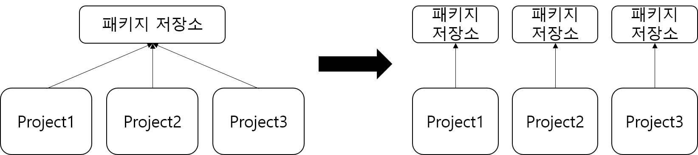

데이터과학 전 분야에서 reproducible research가 중요해지고 있다. reproducible research를 위해서는 어떤 개발환경에서든 원 개발 버전과 동일한 환경을 보존해야하는데, 이 때 장애물이 되는 것이 운영체제, r 버전, r 패키지 버전 별로 동일한 환경을 구축하는 일이다. reproducible research를 쉽게 할 수 있게 해주는 대표적인 패키지인 renv, packrat에 대해 알아보자.

# packrat 소개



packrat은 프로젝트 별로 독립된 환경을 구축해주는 패키지이다. 보통 Rstudio에서 프로젝트를 관리할 때 모든 프로젝트는 현재 설치된 R 최신 버전에 맞는 하나의 패키지 소스에서 불러온다(패키지 설치 경로는 **.libs**로 확인할 수 있다). R 최신 버전을 사용할 때는 문제가 없지만 R 이전 버전 혹은 패키지 이전 버전을 사용해야할 경우 R을 버전에 맞게 재설치해주어야하고 패키지도 버전을 낮춰서 재설치해주어야 하기 때문에 매우 번거롭다. 또 패키지 버전을 낮추게 되면 패키지 끼리 충돌이 일어날 수 있고, 다른 프로젝트에서 분석을 진행할 때 영향을 미치기 때문에 다시 버전 업을 해줘야 한다.

## docker 소개

docker 설치 방법 및 구동 방법은 <https://www.youtube.com/watch?v=VVxvL4xRPjU> 에 잘 정리되어있다.

R은 도커 허브에 rocker라는 이름으로 등록된 많은 image 파일이 있다. 필요한 상황에 맞는 image를 찾아서 다운을 받으면 된다.

**rocker image 설치 방법**

window powershell을 키고 아래 문법을 입력하면 설치가 된다.

\$ docker pull rocker/rstudio:3.6.0

컴퓨터에 설치된 docker image 목록을 확인할 수 있다.

\$ docker image list

**rocekr image 실행 방법**

1.  프로젝트 파일을 생성한다.

    r server에서 실행 후 저장한 R script, csv 등의 모든 파일을 local 컴퓨터에 저장하는 폴더를 만드는 것이다.

    

    

2.  아래 코드를 실행하면 다운받은 image가 실행된다.

\$ docker run -d -e USERID=\$UID -e PASSWORD=1111 -v \${pwd}:/work -p 7009:8787 rocker/rstudio:3.6.0


| 옵션 | 설명                                 |
|------|--------------------------------------|
| -d   | detach mode(백그라운드 모드)         |
| -p   | 호스트와 컨테이너의 포트를 연결      |
| -e   | 컨테이너 내에서 사용할 환경변수 설정 |
| -v   | 호스트와 컨테이너의 디렉토리를 연결  |

: 참고 : <https://cultivo-hy.github.io/docker/image/usage/2019/03/14/Docker%EC%A0%95%EB%A6%AC/>


2.  구글 크롬에 접속해서 **localhost:7009**를 주소창에 입력한다.

    -   아이디 : rstudio

    -   비밀번호 : -e PASSWORD에 입력한 1111

    -   아래와 같은 rstudio 창이 나오면 완료


## packrat 사용법

rstudio 서버에서 아래 코드를 순차적으로 실행한다.

먼저 docker run에서 마운드한 위치는 /work이므로 setwd로 위치를 변경해준다.

```{r, eval = FALSE}
setwd('/work')
```

새로운 프로젝트를 생성하는 것이므로 R script, csv 데이터 등을 저장할 새 디렉토리를 생성한다. packrat::init을 실행하게 되면 일반 프로젝트에서 packrat 프로젝트로 전환된다. 즉. 자체 개인 패키지 라이브러리가 있는 프로젝트로 전환되며, 설치된 패키지는 해당 프로젝트에서만 사용할 수 있다.

```{r, eval = FALSE}
install.packages("packrat")

packrat::init("/work")
```


```{r, eval = FALSE}
.libPaths()
packrat::on("/work")

.libPaths()
```


packrat::on으로 packrat 모드를 키게 되면 work 디렉토리에 packrat 폴더로 패키지 저장 위치가 업데이트된다.

```{r, eval = FALSE}
install.packages("tidyverse")

```


패키지 snapshot을 보면 R 3.6 기준 2019-07-05에 업데이트된 tidyverse 패키지를 설치한다. 패키지 설치는 local에 설치하는 속도보다 몇 배 이상 오래걸릴 수 있다.

R script를 새로 생성하고 적당한 예제 코드를 작성 후에 저장을 하게되면 work 디렉토리에 R script 파일이 저장되는 것을 볼 수 있다. server 상에서 저장한 이 파일은 local 컴퓨터에 생성했던 프로젝트 파일 test_project2에도 동일하게 저장된다.


```{r, eval = FALSE}
packrat::snapshot()
```

packrat::snapshot()을 이용하면 라이브러리의 현재 상태(현재 설치된 패키지 버전)를 저장할 수 있다.

이것도 저장하는 속도가 생각보다 많이 느리다. 한번 저장해놓으면 계속 쓸 수 있지만 속도가 느린 것은 치명적인 단점인 것 같다.

```{r, eval = FALSE}
packrat::restore()
```

packrat::restore()을 이용하면 최근 스냅샷에 저장된 라이브러리 상태를 복원할 수 있다.

# renv

**참고 자료**

<https://www.youtube.com/watch?v=Z0Tm-Y7vzNQ>

<https://www.youtube.com/watch?v=VVxvL4xRPjU>

<https://rstudio.github.io/packrat/>

